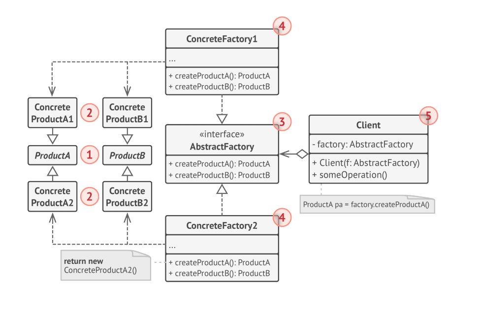

# Abstract Factory Pattern

The **Abstract Factory Pattern** is a creational design pattern that provides an interface for creating families of related or dependent objects without specifying their concrete classes. It enhances modularity and scalability by making the code more flexible and easier to maintain when dealing with multiple variants of a group of products.

## Key Components

- **Abstract Factory**: An interface that declares methods for creating each of the abstract products.
- **Concrete Factory**: Implements the methods of the abstract factory to create concrete products. Each one corresponds to a specific variant of products and creates all products of that variant.
- **Abstract Product**: An interface for a type of product with multiple variants.
- **Concrete Product**: Concrete implementations of the abstract product interface, created by a corresponding concrete factory.
- **Client**: Uses interfaces declared by the abstract factory and abstract product classes, unaware of the concrete classes being used.

## Workflow

1. The **client code** calls a method from a **concrete factory** to create a product, which returns a product of a specific variant to the client code, while keeping the concrete product class hidden.
2. The client interacts with the products through the interfaces declared by the **abstract factory** and **abstract products**, remaining independent of the concrete implementations.

## Benefits

- Promotes the Open/Closed Principle, allowing systems to be extended with new product families without modifying existing client code.
- Enhances flexibility and scalability by abstracting the creation process of related product families.
- Reduces coupling between client code and specific product classes, making the system easier to extend and maintain.

## Example Use Case

Consider a UI toolkit that needs to support multiple themes (like dark mode and light mode), where each theme has its own variant of UI elements (buttons, checkboxes, etc.). The Abstract Factory Pattern allows the toolkit to instantiate theme-specific elements without binding the application's code to specific classes for each theme, enabling the client code to work with any theme at runtime, depending on the concrete factory instance it's given.

The below image is taken from the **Alexander Shvets** *Dive in to design pattern*. 

